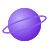

 

✦ Startup fictícia • Projeto de Programação Orientada a Objetos ✦

  

A **Carroll Studios** é a startup fictícia criada pelo nosso grupo para a disciplina de **Programação Orientada a Objetos**. Aqui reunimos o planejamento, a organização da equipe e a evolução dos nossos projetos — do design ao código, sempre em conjunto.

<table>
<tr>
<td width="50%" align="center">

### 🗂️ Agenda de Contatos

Um app para organizar contatos, com os favoritos exibidos em forma de constelação.

**🚧 Em desenvolvimento**

</td>
<td width="50%" align="center">

### 🚀 Jogo Espacial

Um jogo educativo: a nave se quebra no espaço e é preciso reconstruí-la respondendo perguntas.

**🚧 Em desenvolvimento**

</td>
</tr>
</table>

<table>
<tr>
<td align="center" width="25%">
 
<b>Nome da integrante</b> 
Função 

</td>
<td align="center" width="25%">
 
<b>Nome da integrante</b> 
Função 

</td>
<td align="center" width="25%">
 
<b>Nome da integrante</b> 
Função 

</td>
<td align="center" width="25%">
 
<b>Nome da integrante</b> 
Função 

</td>
</tr>
</table>

Troque <code>./assets/planet-avatar.svg</code> por <code>https://github.com/USUARIO.png</code> (a foto de perfil do GitHub de cada uma), preencha nome/função e o link de cada uma. Duplique ou apague colunas conforme o número real de integrantes.

 

✦ Carroll Studios ✦
  

