 

✦ Startup fictícia • Projeto de Programação Orientada a Objetos ✦

  

A **Carroll Studios** nasceu como a startup fictícia da nossa equipe, estudantes de **Informática do IFCE Maranguape**, criada para a disciplina de **Programação Orientada a Objetos**. Assim como uma constelação, cada projeto é um ponto de luz que se conecta aos demais, formando o mapa da nossa jornada como desenvolvedoras. Aqui reunimos planejamento, organização de equipe e evolução técnica dos nossos projetos — do design ao código, sempre em conjunto.

<table>
<tr>
<td width="50%" align="center">

### 🗂️ Agenda de Contatos

Um app para organizar contatos, com os favoritos exibidos em forma de constelação.

**🚧 Em desenvolvimento**

</td>
<td width="50%" align="center">

### 🚀 Jogo Espacial

Um jogo educativo: a nave se quebra no espaço e é preciso reconstruí-la respondendo perguntas.

**🚧 Em desenvolvimento**

</td>
</tr>
</table>

<table>
<tr>
<td align="center" width="18%">
 
<b>Giovanna Sampaio</b> 
Design & Front-end 

</td>
<td align="center" width="2%" valign="middle">✦</td>
<td align="center" width="18%">
 
<b>Hadassa Micaele</b> 
Banco de Dados 

</td>
<td align="center" width="2%" valign="middle">✦</td>
<td align="center" width="18%">
 
<b>Isabelly Gomes</b> 
Backend 

</td>
<td align="center" width="2%" valign="middle">✦</td>
<td align="center" width="18%">
 
<b>Julia</b> 
Front-end 

</td>
<td align="center" width="2%" valign="middle">✦</td>
<td align="center" width="18%">
 
<b>Yasmin</b> 
Backend 

</td>
</tr>
</table>

 

✦ Carroll Studios ✦
  

